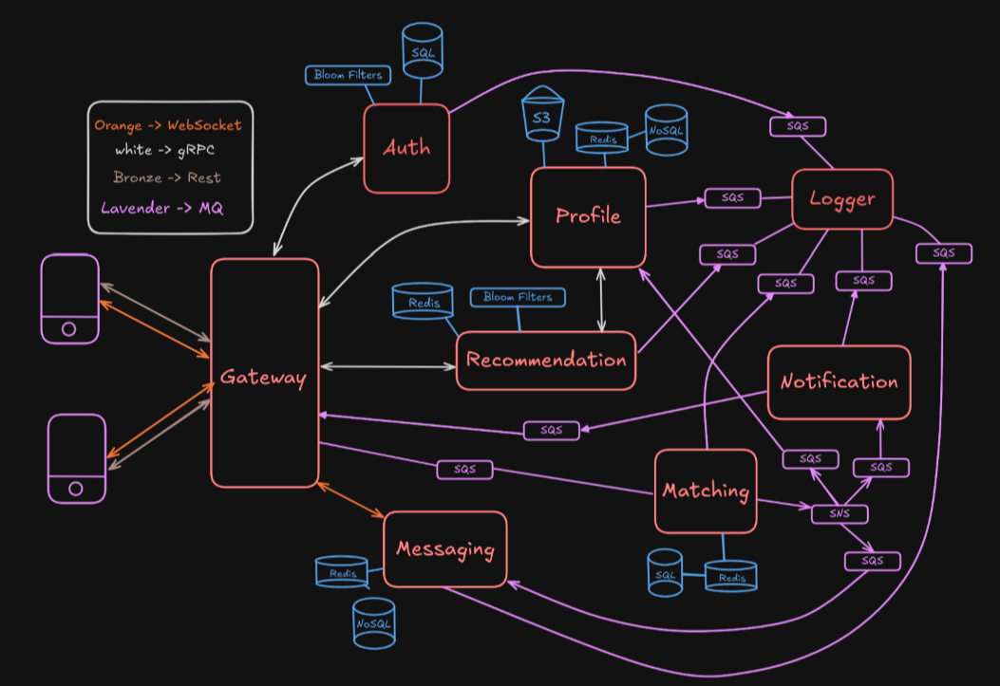

# 🧠 Twindr

A monorepo for super scalable dating application.
Includes multiple microservices utlising gRPC, Rest, SNS+SQS, GraphQL.


## 📁 Monorepo Structure

```
.
├── Apps              # Frontend apps
├────── Next
├────── Expo
├── Server            # Backend microservices
├────── Auth
├────── Gateway
├────── Matching
├────── Messaging
├────── Notification
├────── Profile
├────── Recommendation
├── Packages          # Shared code
├────── Proto
├── package.json
└── turbo.json
```

## 🚀 Getting Started

### 1. Install dependencies

```bash
bun install
```

### 2. Start all dev servers

```bash
bun run dev
```

### 3. Build everything

```bash
bun run build
```

Stay isolated, stay clean ✨

